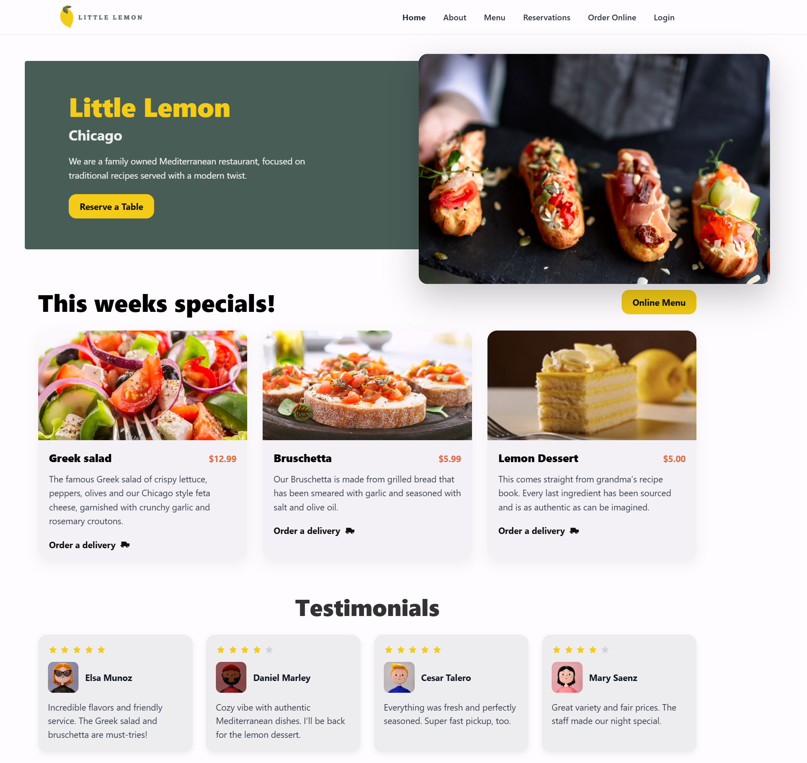
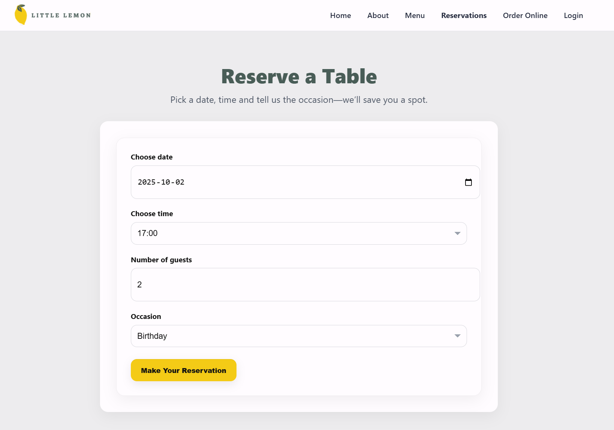
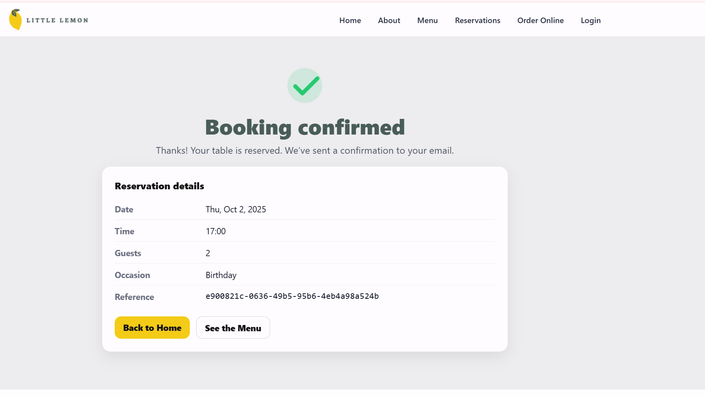

# 🍋 Little Lemon Restaurant Booking App

A React single-page application for the **Little Lemon** Mediterranean restaurant.
Built as part of the Front-End Developer capstone project. It features a marketing site (home page), an interactive booking form, and a booking confirmation page.
---

## 🚀 Getting started

### 1. Clone the repo

```bash
git clone https://github.com/your-username/little-lemon-booking.git
cd little-lemon-booking
```

### 2. Install dependencies

```bash
npm install
```
### 3. Run the app

```bash
npm start
```

Open [http://localhost:3000](http://localhost:3000) in your browser.

---

## 🧪 Running tests

```bash
npm test
```

Tests include:

* `BookingForm.test.js` → renders form labels, options, and handles submission.
* `bookingTimes.test.js` → validates `initializeTimes` and `updateTimes` reducer logic with mocked API.

---


## ✨ Features

* **Home page** with hero, highlights, testimonials, about section, and footer.
* **Responsive navigation bar** with React Router links.
* **Booking page** with a reservation form:

  * Select date, time, number of guests, and occasion.
  * Available times update dynamically based on date (via `fetchAPI`).
  * Form validated for required fields.
* **Booking confirmation page** displaying reservation details after submission.
* **Unit tests** for booking reducer (`initializeTimes` / `updateTimes`) and form rendering.
* Styled with plain CSS modules (no Tailwind/Bootstrap).

---

## 🛠️ Tech stack

* **React 18**
* **React Router DOM**
* **Jest** / **React Testing Library** 
* Plain **CSS** for styling

---

## 📸 Screens

* **Home page** with hero, specials, testimonials, about section


* **Booking page** with reservation form


* **Confirmation page** after a successful booking

---

## 📜 License

This project is for educational purposes (Front-End Developer Capstone).
Feel free to fork and adapt for your own learning.


